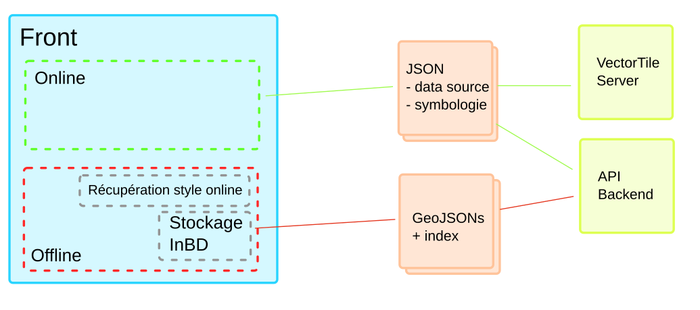

# Database Documention

## Repo structure

```
├── bin .................... tools to install DB for example.
├── sql .................... database components.
├── conf ................... configuration.
└── README.md
```

## Database structure

Thee database has 3 mains schemas.

```
├── config   .................... Schema that stores APP configuration.
└── app      .................... Schema that stores APP data
```

The assets are stored in one o several schemas of the same database.
In the layer configuration table, we specify the exact location of the asset tables.


### > Config Schema

The config schema stores all the configuration tables.

#### TABLE : application_domain

This core configuration table defines the business domains that the application manages.
Parent domains appear in the application interface as button that opens a drawer.
The child domains generates a tab in the drawer in which the user sees a simplified layer tree.

#### TABLE :  layer

The layer table defines all the layers that are managed by the application.
A layer can be attached to an application domain and points to a PG table.
To organize the layer in the different trees, the application uses the tree table.
As tree group can be different in the simplified and detailed layer tree, the layer has 2 fields thats points to the tree table.

#### TABLE :  business_object

This configuration table defines the business objects to which the application can generate work orders. The type is the code that will be used in the application to make relation between an asset and a work order.

#### TABLE :  tree

This table defines the tree exposed in the application.
The tree  table is used to generate the simplified and the detailed layer tree.

:warning: **A group tree can be in a the simplified layer tree and not in the detailed tree.** :warning:

To generate the different trees, 2 views are implemented:
- v_simplified_layer_tree : this view gives for each layer the parent domain, the tab it belongs to and its tree group .
- v_detailed_layer_tree : this view gives for each layer the parent domain, its parent group and its group .

#### TABLE :  basemaps

This table lists up the web services exposed as basemaps in the application.
The table is based on the openlayers structure.

Example WMS Openlayers:
```
// For more information about the IGN API key see
// https://geoservices.ign.fr/blog/2021/01/29/Maj_Cles_Geoservices.html
const ign_source = new WMTS({
  url: 'https://wxs.ign.fr/choisirgeoportail/geoportail/wmts',
  layer: 'GEOGRAPHICALGRIDSYSTEMS.PLANIGNV2',
  matrixSet: 'PM',
  format: 'image/png',
  projection: 'EPSG:3857',
  tileGrid: tileGrid,
  style: 'normal',
  attributions:
    '<a href="https://www.ign.fr/" target="_blank">' +
    '</a>',
});
```


# GEOJSON Production

### Simplified architecture to produce GEOJSON:



## How to produce the grid

Function to  create the grid (if postgis > 3.1, better using the ST_SquareGrid function) :

```sql
-- Function to create grid / used to produce geojson on a specified extent
CREATE OR REPLACE FUNCTION ST_CreateFishnet(
        nrow integer, ncol integer,
        xsize float8, ysize float8,
        x0 float8 DEFAULT 0, y0 float8 DEFAULT 0,
        OUT "row" integer, OUT col integer,
        OUT geom geometry)
    RETURNS SETOF record AS
$$
SELECT i + 1 AS row, j + 1 AS col, ST_Translate(cell, j * $3 + $5, i * $4 + $6) AS geom
FROM generate_series(0, $1 - 1) AS i,
     generate_series(0, $2 - 1) AS j,
(
SELECT ('POLYGON((0 0, 0 '||$4||', '||$3||' '||$4||', '||$3||' 0,0 0))')::geometry AS cell
) AS foo;
$$ LANGUAGE sql IMMUTABLE STRICT;
```

Generating grid :

```sql
drop table app_grid;
create table app_grid as
with grid as (
	select ST_CreateFishnet(10, 10, 100000, 100000, 99040, 6125317) as res
)
select row_number() OVER () AS id, st_setsrid((g.res).geom, 2154) as geom
from grid g;
```

Pour l'exemple j'ai fait du 10 par 10.

Calcul des bbox pour les fichiers à générer :

```sql
drop table canalisation_index;
create table canalisation_index as
select 'canalisation_'||id||'.geojson' as file, st_astext(st_envelope(geom)) as bbox from france_grid
```

Génération du fichier index (au format json) :

```shell
ogr2ogr -f "GEOJSON" output.geojson PG:"host=localhost port=5432 dbname=veolia user=xxx password=xxx" canalisation_index
```

Génération des X fichiers GeoJson contenant les données (ici l'exemple est donné pour la case 63, mais il faut itérer sur les 100 cases bien sur pour générer les 100 fichiers):
```shell
// A scripter en boucle sur les 100 cases
ogr2ogr -f "GEOJSON" output.geojson PG:"host=localhost port=5432 dbname=veolia user=xxx password=xxx" -sql "select * from canalisation c, france_grid g where st_intersects(c.geom, g.geom) and g.id = 63"
```


---
# Questions, remarques

-
